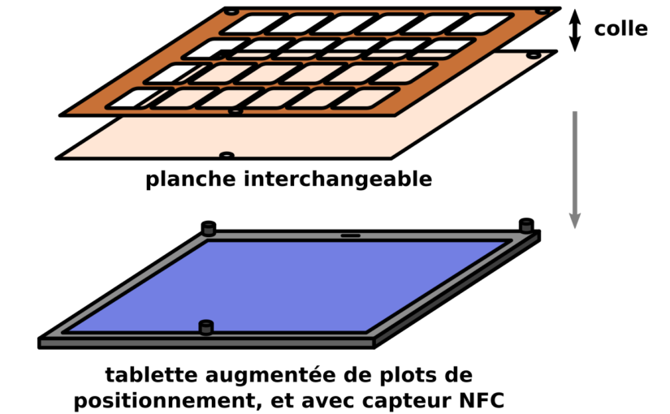

# Avancées

{.float-right .small}

Pictoparle est un [outil de communication](caa.md) **en cours de développement**, développé par une seule personne, à hauteur de deux jours par semaine.

L'outil s'appuie sur une [tablette tactile intégrée à un boîtier](materiel.md), sur lequel l'utilisateur peut placer [la planche](planches.md) de son choix. Un [éditeur en ligne](fabrique.md) permet aux utilisateurs de concevoir et d'adapter l'outil à leurs propres besoins.

C'est une tablette tactile d'entrée de gamme qui fait fonctionner le dispositif. On y installe l'[application](application.md) développée spécialement pour l'outil.

???+ info "Suivi hebdomadaire"
    L'auteur de Pictoparle propose sur cette page, dans un ordre chronologique inversé, les avancées réalisées afin de concevoir, réaliser puis fabriquer l'outil Pictoparle.

## Avancées hebdomadaires

La réalisation du projet a commencé pendant les fins de semaines du confinement imposé par COVID-19, sous forme de sprints réguliers, qui ont fait l'objet d'une publication sur le [blog de l'auteur](https://blog.jmtrivial.info/tag/pictoparle/). À chaque fin de print, une vidéo de démonstration est également proposée [sur la chaîne youtube](https://www.youtube.com/playlist?list=PLrhqb8aQtdhWbA6qzXm57dGk4yxtITH1f).

### 28 juin 2020, sprint 12 : boîtier en medium et améliorations de l'application

<iframe width="355" height="200" src="https://www.youtube.com/embed/awzBzCnelJM" frameborder="0" allow="accelerometer; autoplay; encrypted-media; gyroscope; picture-in-picture" allowfullscreen></iframe>

<iframe width="355" height="200" src="https://www.youtube.com/embed/qaH3NBpz65Y" frameborder="0" allow="accelerometer; autoplay; encrypted-media; gyroscope; picture-in-picture" allowfullscreen></iframe>

Le [douzième sprint](https://blog.jmtrivial.info/2020/06/28/pictoparle-douzieme-sprint/) a été l'occasion de tester puis d'assembler le boîtier
découpé dans du medium, et d'améliorer l'application Pictoparle.

### 22 juin 2020, sprint 11 : sons personnalisés

<iframe width="355" height="200" src="https://www.youtube.com/embed/sKS5lZfW6yM" frameborder="0" allow="accelerometer; autoplay; encrypted-media; gyroscope; picture-in-picture" allowfullscreen></iframe>

Le [onzième sprint](https://blog.jmtrivial.info/2020/06/22/pictoparle-onzieme-sprint/) a été l'occasion d'ajouter le support des sons personnalisés pour chaque pictogramme. Plusieurs bugs problématiques ont également été corrigés dans l'application.

### 14 juin 2020, sprint 10 : préparation du premier prototype en medium

Le [dixième sprint](https://blog.jmtrivial.info/2020/06/14/pictoparle-dixieme-sprint/) a été l'occasion de nombreux ajustements, afin de préparer la première fabrication par découpage laser. Pas de vidéo, mais plein d'images sur le blog.

### 8 juin 2020, sprint 9 : améliorations après utilisation

<iframe width="355" height="200" src="https://www.youtube.com/embed/MOG0_X8GWFI" frameborder="0" allow="accelerometer; autoplay; encrypted-media; gyroscope; picture-in-picture" allowfullscreen></iframe>

Le [neuvième sprint](https://blog.jmtrivial.info/2020/06/08/pictoparle-neuvieme-sprint/) a été l'occasion de nombreuses corrections liées aux retours des premières utilisatrices, ainsi que d'une consolidation des patrons de découpage.

### 1er juin 2020, sprint 8 : patrons de découpage

<iframe width="355" height="200" src="https://www.youtube.com/embed/SOI7z4aCWHQ" frameborder="0" allow="accelerometer; autoplay; encrypted-media; gyroscope; picture-in-picture" allowfullscreen></iframe>

Le [huitième sprint](https://blog.jmtrivial.info/2020/06/01/pictoparle-huitieme-sprint/) présente la génération des [patrons de découpe](fabrication.md) par la fabrique de Pictoparle, pour un découpage manuel ou par machine-outil.

### 25 mai 2020, sprint 7 : maquette physique

<iframe width="355" height="200" src="https://www.youtube.com/embed/i-Jg_FCP96g" frameborder="0" allow="accelerometer; autoplay; encrypted-media; gyroscope; picture-in-picture" allowfullscreen></iframe>

<iframe width="355" height="200" src="https://www.youtube.com/embed/JXX7dQuCEgE" frameborder="0" allow="accelerometer; autoplay; encrypted-media; gyroscope; picture-in-picture" allowfullscreen></iframe>

Le [septième billet](https://blog.jmtrivial.info/2020/05/25/pictoparle-septieme-sprint/) présente la première version d'une [maquette physique](fabrication.md), qui permettra de faire les premiers essais d'ergonomie. Le travail a également continué sur la fabrique de Pictoparle.

### 18 mai 2020, sprint 6 : la fabrique de pictoparle

<iframe width="355" height="200" src="https://www.youtube.com/embed/AvcH3Rek4Jo" frameborder="0" allow="accelerometer; autoplay; encrypted-media; gyroscope; picture-in-picture" allowfullscreen></iframe>

Le [sixième billet](https://blog.jmtrivial.info/2020/05/18/pictoparle-sixieme-sprint/) présente la première version du [site internet](fabrique.md) permettant
de concevoir ses propres planches.

### 10 mai 2020, sprint 5 : maquette numérique et planches personnalisées

<iframe width="355" height="200" src="https://www.youtube.com/embed/kWVCIcq0FZY" frameborder="0" allow="accelerometer; autoplay; encrypted-media; gyroscope; picture-in-picture" allowfullscreen></iframe>

<iframe width="355" height="200" src="https://www.youtube.com/embed/mrsanBGftIQ" frameborder="0" allow="accelerometer; autoplay; encrypted-media; gyroscope; picture-in-picture" allowfullscreen></iframe>

Le [cinquième billet](https://blog.jmtrivial.info/2020/05/10/pictoparle-cinquieme-sprint/) présente la maquette numérique d'assemblage de planche, et la prise en charge de planches personnalisées par l'application.

### 4 mai 2020, sprint 4 : détection automatique des planches et premières planches physiques

<iframe width="355" height="200" src="https://www.youtube.com/embed/R68Y2XyMYhA" frameborder="0" allow="accelerometer; autoplay; encrypted-media; gyroscope; picture-in-picture" allowfullscreen></iframe>

Le [quatrième billet](https://blog.jmtrivial.info/2020/05/04/pictoparle-quatrieme-sprint/) présente la détection automatique des planches, les premières planches physiques, et les configurations étendues possibles, avec plusieurs panneaux de pictogrammes par planche.

### 28 avril 2020, sprint 3 : nouvelle interface et paramétrages

<iframe width="355" height="200" src="https://www.youtube.com/embed/xBwGPgs110A" frameborder="0" allow="accelerometer; autoplay; encrypted-media; gyroscope; picture-in-picture" allowfullscreen></iframe>

Le [troisième billet](https://blog.jmtrivial.info/2020/04/28/pictoparle-troisieme-sprint/) présente les changements de l'interface et les possibilités de paramétrage de l'application.

### 20 avril 2020, sprint 2 : changer de planche, et multi-touch

<iframe width="355" height="200" src="https://www.youtube.com/embed/9FmyvEcUC8c" frameborder="0" allow="accelerometer; autoplay; encrypted-media; gyroscope; picture-in-picture" allowfullscreen></iframe>

Le [deuxième billet](https://blog.jmtrivial.info/2020/04/19/pictoparle-deuxieme-sprint/) présente la possibilité de changer de planche, et la robustesse au multi-touche involontaire sur l'écran de la tablette.

### 14 avril 2020, sprint 1 : faire parler les pictogrammes

<iframe width="355" height="200" src="https://www.youtube.com/embed/bgv24qxebuY" frameborder="0" allow="accelerometer; autoplay; encrypted-media; gyroscope; picture-in-picture" allowfullscreen></iframe>

Le [premier billet](https://blog.jmtrivial.info/2020/04/14/pictoparle-premier-sprint/) présente une première version de l'application, qui affiche une grille de 12 pictogrammes, et permet par double-tap de dire le concept associé au pictogramme.

## Conception

Les premières réflexions qui ont mené à la réalisation de l'outil **Pictoparle** s'inspirent des travaux
de Catherine Rabreau, instructrice en AVJ et formatrice [FISAF](https://www.fisaf.asso.fr/), présentés
lors d'une formation au [CRDV](http://www.crdv.org/) en 2019.

On retrouve des informations concernant les outils qu'elle développe avec l'équipe du Foyer d'accueil médicalisé de Beaubois sur le site [consacré à la maladie de Batten](http://cln.jmfavreau.info/pictogrammes-tactiles.html).

{.medium .float-right}
Début 2020, un [premier article](https://blog.jmtrivial.info/2020/02/23/outil-numerique-pour-la-communication-alternative-augmentee/) sur le blog de l'auteur de Pictoparle fait la synthèse des solutions techniques imaginables pour concevoir un dispositif de pictogramme parlant. On y retrouve, en plus de quelques pistes abandonnées depuis, les idées générales qui sont à l'origine de Pictoparle.
