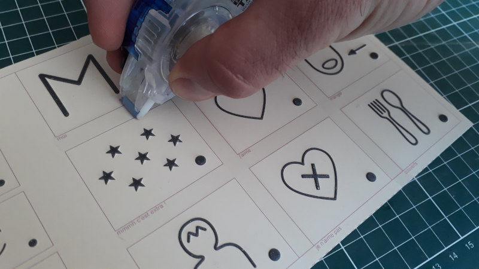
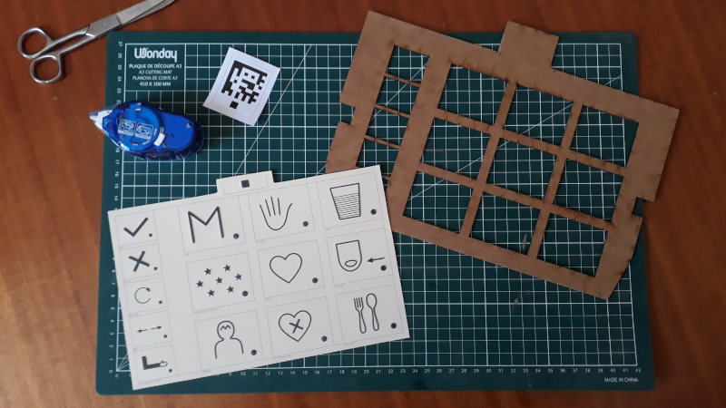
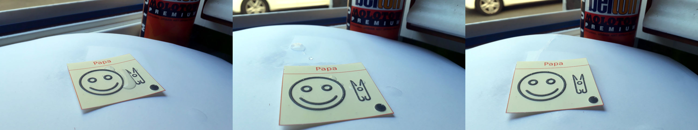

# Conception des planches

<a class="btn-fabrique " href="https://jmtrivial.github.io/pictoparle-fabrique/web/board.html">Fabrique de pictoparle</a>

## La fabrique de Pictoparle

La conception des [planches](planches.md) se fait grâce à la [fabrique de Pictoparle](fabrique.md).
Après avoir choisi le modèle de [tablette](materiel.md), et fait le choix d'une mise en page, on associe à chaque emplacement une image, un texte, et éventuellement un son :

<iframe width="710" height="400" src="https://www.youtube.com/embed/4mJWmcKHyJM" frameborder="0" allow="accelerometer; autoplay; encrypted-media; gyroscope; picture-in-picture" allowfullscreen></iframe>

haque concepteur de planche est libre d'y intégrer ses propres pictogrammes. Nous partageons cependant à titre d'information la [démarche que nous explorons](http://cln.jmfavreau.info/pictogrammes-tactiles.html) pour cette conception.

La fabrique de pictoparle génère trois fichiers distincts:

<iframe width="266" height="150" src="https://www.youtube.com/embed/SOI7z4aCWHQ?start=72" frameborder="0" allow="accelerometer; autoplay; encrypted-media; gyroscope; picture-in-picture" allowfullscreen></iframe>

- un fichier au format ``zip``, que l'on **chargera dans la tablette**, pour que celle-ci puisse prendre en charge la nouvelle planche. C'est aussi le fichier qui permet de sauver une session de travail de conception, pour un rechargement ultérieur.
- un fichier au format ``pdf``, prêt à l'impression puis thermogonflage, pour que les [pictogrammes](pictogrammes.md) soient **accessibles au toucher** à l'utilisateur.
- un fichier au format ``dxf`` ou ``pdf`` servant à la fabrication  du cadre rigide de la planche, qui **matérialise l'espace** entre les pictogrammes.

Après impression de la feuille thermogonflée, et découpage du cadre rigide, l'utilisation d'un assemblage par collage est facilitée par la matérialisation des fenêtres en couleur violette sur les feuilles:

{.medium .float-right}
{.medium .float-right}

L'utilisation d'un vernis sur la planche thermogonglée assure sa protection, et son usage sur le long terme:

## État du développement

Dans sa version actuelle, la fabrique de Pictoparle est fonctionnelle. Elle produit tous les fichiers dans le format attendu, et a permis de fabriquer le premier prototype fonctionnel en medium et thermogonflé. Suivant les besoins exprimés par les utilisateurs et utilisatrices, on pourra amliorer l'outil, par exemple en prenant en charge plus de modèles de tablettes, ou encore en ajoutant la possibilité de concevoir soi-même de nouvelles mises en page.

