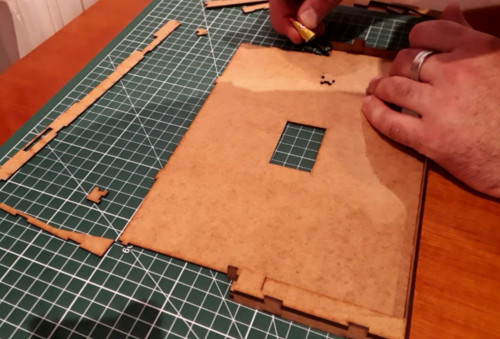
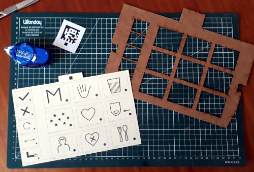
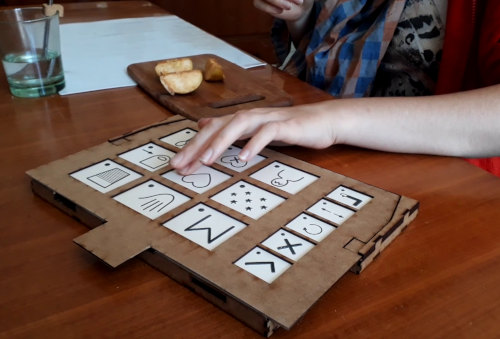

# Pictoparle

???+ info "Utiliser Pictoparle"
    Le site sur lequel vous êtes raconte le développement et le fonctionnement de Pictoparle. Si vous souhaitez des informations pratiques pour l'utiliser, rendez-vous sur 
    [la fabrique de Pictoparle](https://jmtrivial.github.io/pictoparle-fabrique/web/).

{.float-right .small}

Pictoparle est un [outil de communication alternative et augmentée](caa.md) destiné aux personnes en situation de déficience visuelle rencontrant des difficultés dans la communication orale.
La première [période de développement](avancee.md) s'est déroulée début 2020, et l'été a été l'occasion de tester
une première version fonctionnelle. De nouveaux développements se poursuivront dans les mois qui viennent pour affiner 
l'outil, comme [annoncés dans ce résumé de l'été](https://blog.jmtrivial.info/2020/10/04/pictoparle-saison-2/).

Pictoparle permet d'explorer des pictogrammes en relief disposés sur une série de planches, et de déclencher un message associé au préalable à chaque pictogramme. 

<iframe width="710" height="400" src="https://www.youtube.com/embed/oVPHKjqLtiY" frameborder="0" allow="accelerometer; autoplay; encrypted-media; gyroscope; picture-in-picture" allowfullscreen></iframe>

## Fabriquer son Pictoparle

En tant qu'utilisateur ou utilisatrice, vous serez probablement intéressé à ces trois étapes :

| Fabriquer son dispositif | Concevoir ses planches | Utiliser Pictoparle |
|:--------------------------:|:---------------------------------------:|:------------------------:|
|  |  |  |
| [En savoir plus...](fabrication.md) | [En savoir plus...](conception-planches.md) | [En savoir plus...](utilisation.md) |

## Comment ça marche?

Si vous êtes intéressé·e à découvrir comment fonctionne Pictoparle, et à suivre son développement, rendez-vous sur la [page dédiée](avancee.md), où vous pourrez suivre les nouveautés chaque début de semaine.
