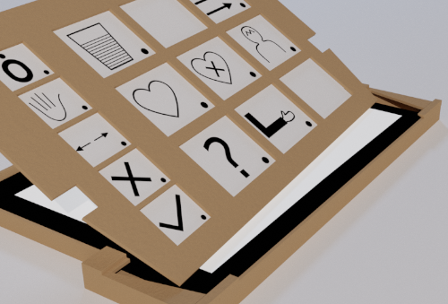
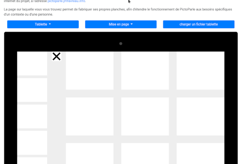
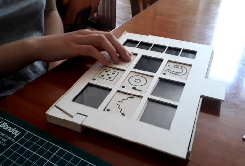

# Pictoparle

{.float-right .small}

Pictoparle est un [outil de communication](caa.md) destiné à une personne en situation de déficience visuelle rencontrant des difficultés dans la communication orale.
Il est [en cours de développement](avancee.md), et sera prêt à être testé dans une première version fonctionnelle courant 2020.

Pictoparle permet d'explorer des pictogrammes en relief disposés sur une série de planches, et de déclencher un message associé au préalable à chaque pictogramme. 

En tant qu'utilisateur ou utilisatrice, vous serez probablement intéressé à ces trois étapes :

| Fabriquer son dispositif | Concevoir ses planches | Utiliser de PictoParle |
|:--------------------------:|:---------------------------------------:|:------------------------:|
|  |  |  |
| [= 5% "Développé à 5%"] | [=50% "Développé à 50%"]   | [=80% "Développé à 80%"]   |
| [En savoir plus...](fabrication.md) | [En savoir plus...](conception-planches.md) | [En savoir plus...](utilisation.md) |

## Comment ça marche?

Si vous êtes intéressé·e à découvrir comment fonctionne Pictoparle, et à suivre son développement, rendez-vous sur la [page dédiée](avancee.md), où vous pourrez suivre les nouveautés chaque début de semaine.
