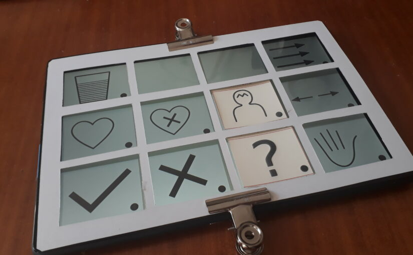

# Logiciel

{.float-right .medium}

L'application développée pour faire fonctionner la tablette dans Pictoparle est conçue pour fonctionner sur une tablette Android. Le code source est disponible [sur le github du projet](https://github.com/jmtrivial/pictoparle), il est écrit en java, et s'appuie au maximum sur des versions éprouvées de l'API. Si l'application pourrait a priori fonctionner sur de nombreuses tablettes, elle a pour l'instant été uniquement utilisée sur une tablette Lenovo 10 pouces équipée d'une version d'Android 8.1.

L'interface s'étoffe progressivement. Voici une description non exhausive de son fonctionnement.

## Interactions

L'application utilise la caméra côté écran pour détecter la présence d'une [planche](planches.md) sur sa surface. L'interaction avec les pictogrammes est proposée par double tap. L'application est capable de détecter la planche présentée automatiquement grâce à un [QR code](https://fr.wikipedia.org/wiki/Code_QR) unique dessiné au verso de chaque planche.

<iframe width="560" height="315" src="https://www.youtube.com/embed/R68Y2XyMYhA" frameborder="0" allow="accelerometer; autoplay; encrypted-media; gyroscope; picture-in-picture" allowfullscreen></iframe>

## Configuration

Les paramètres de l'application permet d'ajuster le comportement l'outil en fonction de l'utilisateur et du matériel utilisé: densité de la verbalisation des actions (changements de planches), taille de l'écran, ajustement du double tap, etc.

<iframe width="560" height="315" src="https://www.youtube.com/embed/xBwGPgs110A" frameborder="0" allow="accelerometer; autoplay; encrypted-media; gyroscope; picture-in-picture" allowfullscreen></iframe>

## Format des planches

Les pictogrammes sont décrits dans des fichiers indépendants, et les planches sont décrites par un fichier facilement modifiable, au format xml.

<iframe width="560" height="315"  src="https://www.youtube.com/embed/kWVCIcq0FZY" frameborder="0" allow="accelerometer; autoplay; encrypted-media; gyroscope; picture-in-picture" allowfullscreen></iframe>

## Compléments

Dans un futur proche, un outil sera également proposé pour générer automatiquement les planches de pictogrammes prêts à l'impression pour le thermogonflage.
