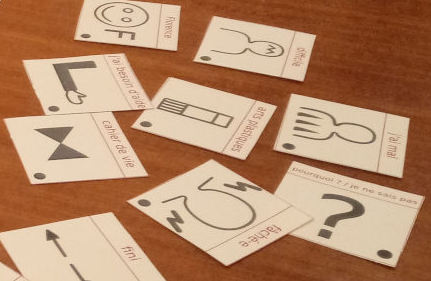
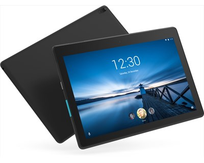
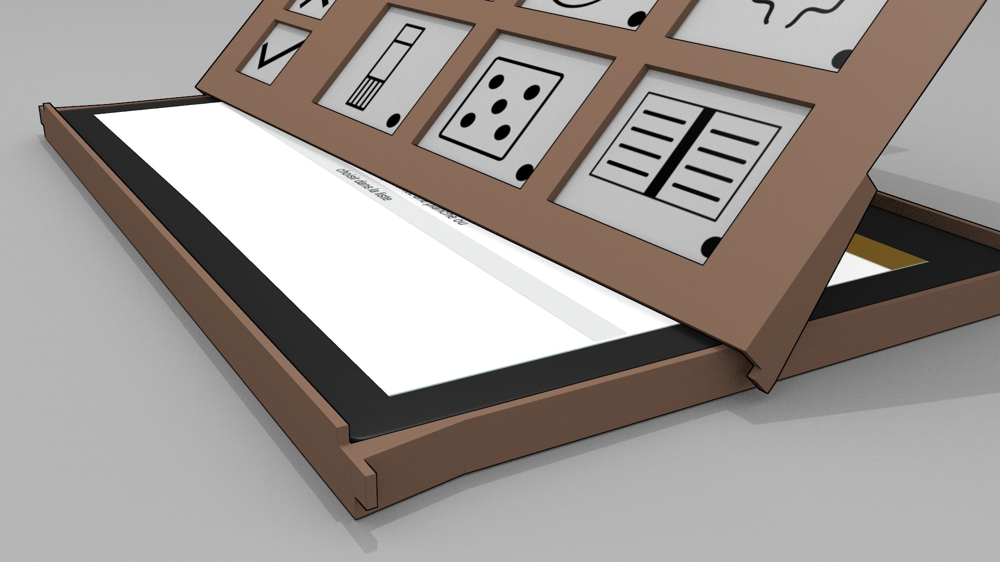

# Le matériel

Le principe tel qu'il a été formalisé dans une [première réflexion](https://blog.jmtrivial.info/2020/02/23/outil-numerique-pour-la-communication-alternative-augmentee/) s'appuie sur une tablette tactile d'entrée de gamme du marché, placée dans un boîtier fabriqué par découpage laser, et recouverte d'une planche de pictogrammes tactiles.

Cette proposition, ainsi que les solutions matérielles proposées dans cette page ne sont qu'une des approches possibles. L'auteur sera heureux d'échanger à ce sujet avec toute personne explorant ses propres solutions alternatives.

## Pictogrammes taciles
{.small .float-right}

Les planches de [pictogrammes tactiles](pictogrammes.md) sont fabriquées par thermogonflage : tout d'abord imprimées sur une feuille de papier dédiée, elle sont ensuite passées au four pour mettre en relief les parties colorées en noir.

Ce support peu onéreux est un outil très répandu pour la présentation d'informations géométriques à destination des personnes en situation de déficience visuelle.

## Tablette tactile

Une tablette tactile est en 2020 le dispositif interactif le plus simple à mettre en place, car sa production en grande série donne accès à des solutions peu onéreuses, économes en énergie, tout en permettant une grande flexibilité grâce à la possibilité d'y concevoir des [applications dédiées](logiciel.md). Une tablette tactile dispose de plus d'une surface réagissant aux interactions d'un utilisateur, et de hauts-parleurs intégrés pour la production du son.

La taille des [pictogrammes](pictogrammes.md) ayant été fixée à 5 centimètres de large par 4 centimètres de haut pour une exploration confortable, on a cherché un format de tablette offrant le meilleur compromis entre disponibilité et nombre de pictogrammes.

{.small .float-right}

Notre choix s'est porté sur une tablette de 10,1 pouces, car la surface permet ainsi d'accueillir 3 lignes de 4 pictogrammes. Nous avons également été attentifs à choisir une tablette disposant d'une caméra côté écran, à un prix raisonnable. Notre choix s'est donc porté sur une tablette Lenovo tab E10, disponible début 2020 aux alentours de 100 euros sur les sites de vente en ligne.

## Boîtier externe

{.medium .float-right}

La partie supérieure du boîtier sera amovible, et chaque planche de pictogrammes sera formée de son propre couvercle, afin de faciliter le changement de planche, un 
peu à la manière de ce qui a été exploré pendant le [quatrième sprint](https://www.youtube.com/watch?v=R68Y2XyMYhA) avec les planches en papier rigide. L'illustration jointe propose un assemblage simple entre les deux parties de la boîte, que l'on peut voir animé sur [une vidéo de simulation 3D](https://www.youtube.com/watch?v=mrsanBGftIQ).
La détection des planches se faisant par la webcam, et grâce à des QRCodes placés au verso, on cherche à concevoir un design à la fois facile d'utilisation, et qui assure une détection de la tablette à chaque fois qu'une nouvelle est placée sur le support. Il faut donc que le geste soit le plus uniforme possible. Dans cette proposition, l'utilisateur est invité à poser le bas de la planche sur la tablette, puis à la faire glisser jusqu'aux butées prévues à cet effet, avant de faire pivoter la planche sur la tablette.

La première version du boîtier externe sera probablement fabriquée en utilisant du medium et une découpeuse laser, avec un assemblage par crénelages, à la manière d'une [précédente réalisation](http://accessibilite.jmtrivial.info/tag/qui-est-ce-tactile/) de l'auteur.

Dans le dessin pour découpage, on prévoiera des ouvertures latérales laissant accès aux boutons de volume et de marche/arrêt de la tablette, à la prise USB pour le chargement, ainsi qu'à la prise jack dans le cas où on voudrait connecter une enceinte, un casque, ou tout autre dispositif de diffusion sonore.

On évitera également de recouvrir les hauts-parleurs de la tablette, afin d'avoir un son le plus clair possible.
