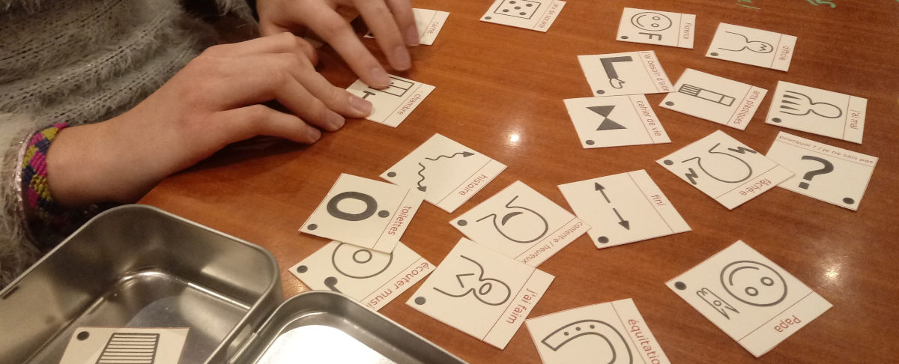

# Les pictogrammes

Les [pictogrammes tactiles](http://cln.jmfavreau.info/pictogrammes-tactiles.html) dédiés aux personnes en situation de déficience visuelle sont une déclinaison de pictogrammes utilisés pour les voyants dans les outils de [communication améliorée et augmentée](caa.md).

Le principe consiste à disposer pour chaque concept utile à la communication une **représentation graphique abstraite**, facilement identifiable par une exploration tactile. On vise la *rapidité de la reconnaissance*, et une *bonne discrimination* entre les pictogrammes.

Pour en savoir plus sur le principe des pictogrammes tactiles, on peut consulter la page [dédiée au même sujet](http://cln.jmfavreau.info/pictogrammes-tactiles.html) sur le site de la maladie de Batten.

L'ensemble des pictogrammes intégrés à Pictoparle sont issus d'une adaptation des pictogrammes conçus au Foyer d'accueil médicalisé de Beaubois. Ils seront proposés sous forme de bibliothèque prête à l'impression quand Pictoparle sera plus avancé dans son développement. Dans l'outil, ils sont agencés sous forme de [planches](planches.md) inspirées des tableaux de langage assisté.

