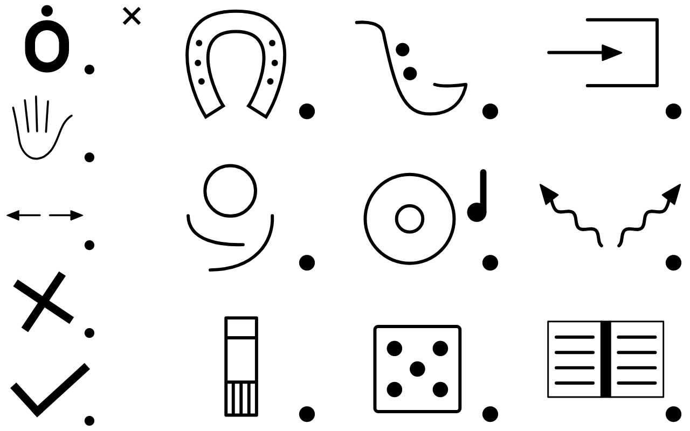

# Les planches

La couverture de Pictoparle est interchangeable, permettant d'utiliser successivement plusieurs dispositions de [pictogrammes](pictogrammes.md) tactiles.

## Inspiration

Il existe dans les outils dédiés à la communication alternative et augmentée des outils ressemblant beaucoup à Pictoparle. Il s'agit généralement de [Tableaux de Langage Assisté](http://www.aplusieursvoix.com/?p=241) (TLA), très souvent conçus pour des personnes voyantes. On trouve ainsi des guides à la conception et au bon usage des TLA, comme cet [article très complet](http://www.caapables.fr/wp-content/uploads/2020/04/Les-TLA-ALD-Article-complet-Mathilde-SUC-MELLA.pdf) de Mathilde Suc-Mella. On y retrouve notamment l'idée d'avoir un tableau par contexte d'utilisation.

## Possibilités de Pictoparle

{.medium .float-right}

L'outil Pictoparle permet de décrire des planches composées d'une série de grilles de pictogrammes. Un [exemple de fichier de description](https://github.com/jmtrivial/pictoparle/blob/master/app/src/main/res/xml/activites.xml) est consultable dans le code source du programme, et l'image reproduite ici donne un exemple de configuration. On y retrouve une ligne verticale de 5 pictogrammes disposée à gauche, et une grille de 3 pictogrammes par 3 pictogrammes, de plus grande taille, disposée à droite. La ligne verticale constitue dans nos expérimentations des pictogrammes récurrents.

Un éditeur de planches sera bientôt proposé, afin de permettre aux utilisateurs de concevoir et d'adapter l'outil à leurs propres besoins.

