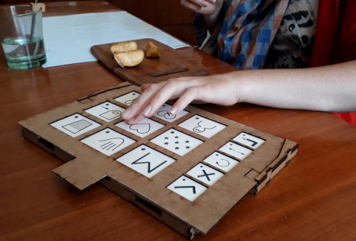

# Utilisation de Pictoparle

[=95% "Développé à 95%"]

## Interaction avec les pictogrammes

Une fois que vous aurez [fabriqué votre dispositif](fabrication.md) et éventuellement [conçu vos planches personnalisées](conception-planches.md), vous pourrez alors utiliser Pictoparle. L'utilisateur peut explorer par le toucher les pictogrammes, et déclencher le message associé grâce à un double tap sur le pictogramme. Ce message peut être produit par une voix de synthèse, ou personnalisé au moment de la conception de la planche.

{.medium .float-right}

L'outil se présente sous forme d'un [boîtier](materiel.md) d'environ 25 centimètres de large par 15 centimètres de hauteur, et d'une épaisseur d'environ un centimètre, sur lequel l'utilisateur vient placer les [planche](planches.md) de son choix, issues des planches proposées par défaut, ou imaginées par vos soins.

Lorsque l'utilisateur place une planche sur le dispositif, celle-ci est automatiquement reconnue, et l'utilisateur en est informé :

<iframe width="710" height="400" src="https://www.youtube.com/embed/oVPHKjqLtiY" frameborder="0" allow="accelerometer; autoplay; encrypted-media; gyroscope; picture-in-picture" allowfullscreen></iframe>

En plus de la souplesse offerte par le choix de mise en page lors de la [conception des planches](conception-planches.md), l'[application](application.md) est largement configurable pour s'adapter aux besoins de chaque utilisateur.

## État du développement

L'application Android Pictoparle qui prend en charge toutes les interactions avec l'utilisateur est aujourd'hui fonctionnelle.
De nouvelles fonctionnalités pourront être ajoutées suivant les besoins des utilisateurs.

